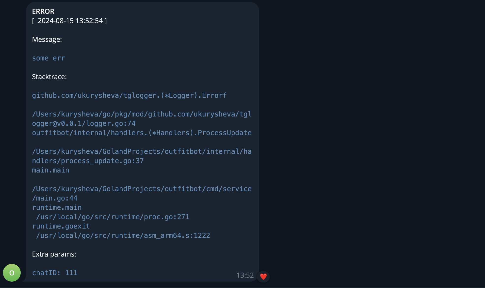

# tglogger

Go Package tglogger provides easy way to send your error log with stacktrace and extra info to your telegram bot.

## Getting started

### Install

```
go get github.com/ukurysheva/tglogger
```

### Requirements

Tglogger requires some environment variables to be set:
- `TG_LOGGER_TOKEN`
- `TG_LOGGER_CHAT_ID`

### Usage
```go
import (
	"github.com/ukurysheva/tglogger"
)

tglogger.Warn("some err")

tglogger.Errorf("some err")

// Use option WithFields to set map of important fields
tglogger.WithFields(tglogger.Fields{"chatID": 111}).Errorf("some err")
```
### Outputs



## FAQ
### How to get token

Create your telegram bot and save `token` via @BotFather

### How to get chat id 

Get your `chat id` via @getmyid_bot